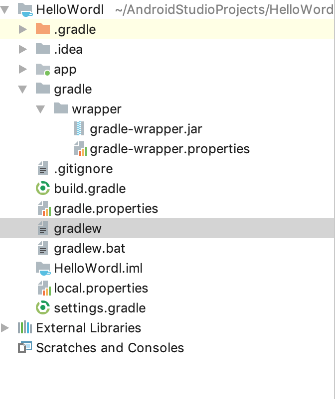
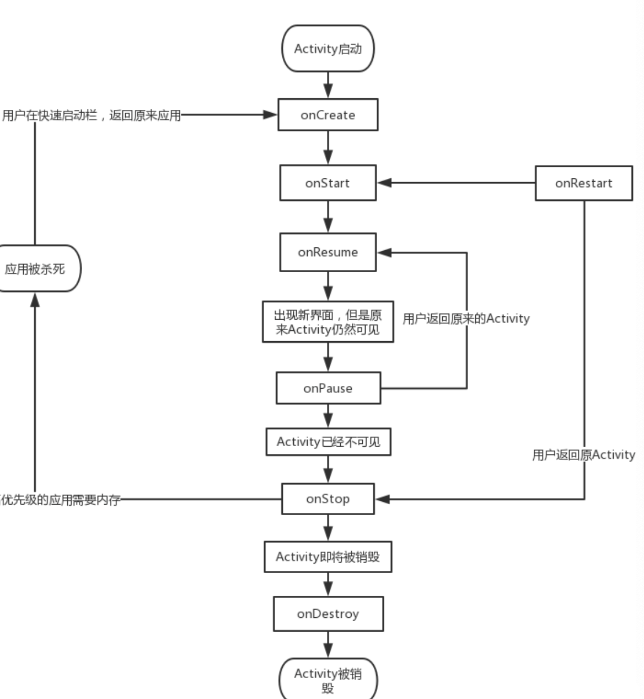
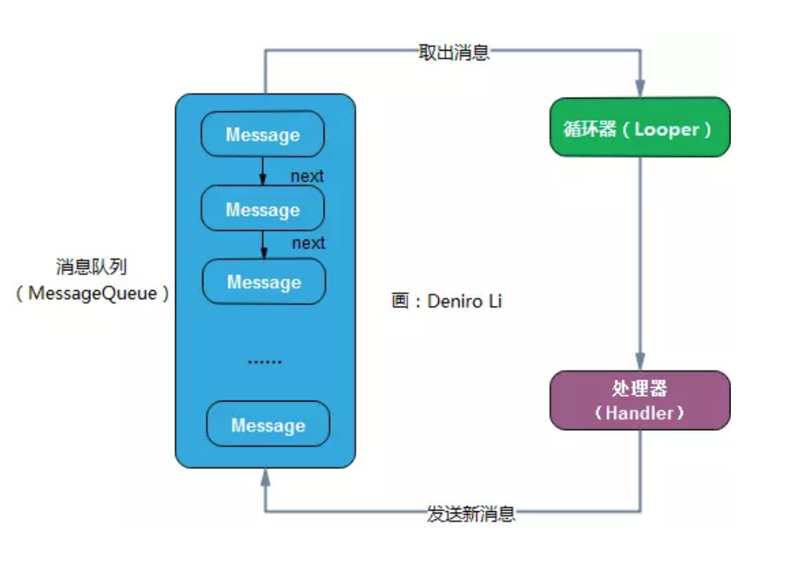

# Android

## 第一次课：Android初识及开发环境搭建

<https://www.jianshu.com/p/ecce85b3ef70>

### Android历史

Android是2003年10月由Andy Rubin创建的公司，于2005年8月被Google收购，于2008年推出了Android系统的第一个版本,目前最新版本是Android9.0

Android四大要素：活动、服务、广播接收器、内容提供器

### Android开发工具

使用Android Studio，下载地址为https://developer.android.google.cn/studio/index.html

### Android项目代码框架



- app是存放源码的地方
  - src/main/java 用来存放代码
  - src/res用来存放资源
  - AndroidMainfest.xml 软件清单列表https://www.jianshu.com/p/3b5b89d4e154
  - build.gradle 用来构建项目的，有点类似于ios中的info.plist文件，指明你这个程序能兼容到多少版本啊，需要什么依赖库之类的
  - proguard-rules.pro 代码混淆的
- gradle
  - gradle是一种构建工具，帮你管理项目中的差异,依赖,编译,打包,部署......,你可以定义满足自己需要的构建逻辑,写入到build.gradle中供日后复用.gradle既可以完成自动化的打包动作(类似于Ant)，又可以解决包依赖的动作(类似于Maven)
  - grade-wrapper是用来安装gradle的
- build-gradle 在这里是用来解决全局依赖，表示程序仓库用的是哪个仓库，使用gradle的哪个插  件来构建Android程序

### Helloworld工程的搭建

- Activity和AppCompatActivity的区别

> AppcompaActivity相对于Activity的主要的两点变化
>
> + 主界面带有toolbar的标题栏；
> + theme主题只能用android:theme=”@style/AppTheme （appTheme主题或者其子类），而不能用android:style。 否则会提示错误： Caused by: java.lang.IllegalStateException: You need to use a Theme.AppCompat theme (or descendant) with this activity.

- 名称的修改

## 活动

### 活动是什么？

活动是包含用户界面的组件，主要用于和用户进行交互

在Android中，活动由Activity和布局组成

### 手动创建第一个互动

- 理解Andorid工程运行的机制

- 理解Action和Category
  - Action是活动执行的动作
  - Category是活动执行的环境

#### 活动之间的交互

活动之间通过Intent进行交互，该交互方式分为两种，一种是显示交互，一种是隐式交互

##### Intent

Intent是Android程序中各组件之间进行交互的最重要方式，一般用户启动活动、启动服务以及发送广播等场景。Intent分为显示Intent和隐式Intent

##### 显示交互

```java
Intent intent = new Intent(Context,Class<?> cls)
startActivity(intent)
```

##### 隐式交互

###### 自己程序内部的转换

通过定义AndroidMainfest.xml中创作，隐式交互是通过配置文件执行的，通过在intent下配置```intent-filter```来实现

###### 与其他程序活动的转换

data标签

- android:schema
- android:host
- android:port
- android:path
- android:mimeType

实验作业

1、完成Android sutdio 环境搭建

2、用自己的学号和名字作为HelloWorld，要求Actionbar显示学号，TextView显示你的名字

3、自己设计，使用Intent进行活动之间的跳转，要求使用隐式和显示

#### 第二次课：传递数据

向下一个活动传递数据(场景描述：从A活动到B活动，将A中的数据传递给B活动)

```java
//放置数据,在A中的Activity中
intent.putExtra("key",value);
//取得数据,在B中的Activity中
intent.getStringExtra("key");
```

返回数据给上一个活动(场景描述：从A活动到B活动，再从B活动返回到A活动，数据由B传递给A)

```java
//在A活动中进行启动和接收
//启动
startActivityForResult(intent,1)
//接收
onActivityResult(int reqCode,int resCode,Intent data);

//在B活动中进行发送
setResult(int resCode,intent);
```

<font color="blue">上课演示错误描述：从B活动返回到A活动中并未触发onActivityResult</font>

<font color="red">原因:因为演示时app仍停留在B活动上，若想触发A活动中的onActivityResult方法，必须让程序回到A活动中，因此在B活动发送完后调用```finish() ```方法</font>

### 活动的生命周期



明白活动的生命周期七种方法在何时可以被调用

### 活动的启动模式

在AndroidMainfest.xml中的activity里面配置

```xml
<activity android:name=".SecondActivity"
            android:launchMode="">
<intent-filter>
   <action android:name="com.ruirui"></action>
   <category android:name="android.intent.category.DEFAULT"></category>
 </intent-filter>
 </activity>
```

standard,singleTop,singleTask,singleInstance

## 界面布局

- 线性布局:LinearLayout

```
<android:orientation="vertical">//竖直方向布局
<android:orientation="horizontal">//水平方向布局
android:gravity和android:layout_gravity
android:layout_weight 权重
```

- 相对布局:RelativeLayout

既可以相对于整个页面进行布局，也可以针对一些组件进行布局

- 桢布局:FrameLayout

一个空间占据

- 百分比布局:PercentFrameLayout和PercentRelativeLayout

需要在app/build.gradle文件中添加

```gradle
compile 'com.android.support:percent:24.2.1'
```

<font color="blue">上课演示错误描述：gradle并未按照上述配置进行自动加载</font>

<font color="red">错误原因：compile在build.gradle中是一种过时的配置方法了，已于2018年底被废弃掉了，被implementation取代了，因此正确配置如下</font>

```implementation 'com.android.support:percent:24.2.1'```或者使用最新版本，截止到目前是

```
implementation 'com.android.support:percent:28.0.0'
```

- 约束布局：ConstraintLayout

从 Android Studio 2.3 起官方的模板默认使用 ConstraintLayout，适用于复杂的相对定位

## UI界面

### 常用组件

#### TextView

#### Button

#### EditText

#### ImageView

#####    第三方框架glide加载网络图片

   https://github.com/bumptech/glide

 配置

```gradle
repositories {
  mavenCentral()
  google()
}

dependencies {
  implementation 'com.github.bumptech.glide:glide:4.9.0'
  annotationProcessor 'com.github.bumptech.glide:compiler:4.9.0'
}
```

   <font color="red">常见错误：missing INTERNET permission</font> ,在Androidmainfest.xml里面加上如下配置

```
<uses-permission android:name="android.permission.INTERNET"></uses-permission>
```

在活动中输入如下代码

```java
Glide.with(this).load("https://www.baidu.com/img/bd_logo1.png?where=super").into(imageView);//加载百度图片
```

#### ProgressBar

#### AlertDialog（上课未讲）

```java
 AlertDialog.Builder dialog = new AlertDialog.Builder(FirstActivity.this);
 dialog.setTitle("Alertdialog");
 dialog.setMessage("We study AlertDialog");
 dialog.setPositiveButton("OK", new DialogInterface.OnClickListener() {
     @Override
     public void onClick(DialogInterface dialog, int which) {
         Log.d(TAG, "onClick: alertdialog click");
     }
 });
 dialog.setNegativeButton("Cancel", new DialogInterface.OnClickListener() {
     @Override
     public void onClick(DialogInterface dialog, int which) {
         Log.d(TAG, "onClick: alertdialog cancel");
     }
 });
 dialog.show();
```

#### ListView

ListView是一种列表结构，配合Adapter对象传递列表数据显示

##### 系统默认提供样式

```java

ListView listView = findViewById(R.id.listview);
//android.R.layout.simple_list_item_1是Android Studio提供的一种样式，更多请看下面，特别要注意第二个参数的使用
ArrayAdapter<String> adapter = new ArrayAdapter<String>(ListViewActivity.this,android.R.layout.simple_list_item_1,data);

listView.setAdapter(adapter);

//listview触发点击对象的方法
listView.setOnItemClickListener(new AdapterView.OnItemClickListener() {
    @Override
    public void onItemClick(AdapterView<?> parent, View view, int position, long id
    {

    }
});
```

Android提供了系统自带的几种listview的item样式

◾android.R.layout.simple_list_item_1   一行text
◾android.R.layout.simple_list_item_2   一行title，一行text
◾android.R.layout.simple_list_item_single_choice   单选按钮
◾android.R.layout.simple_list_item_multiple_choice   多选按钮
◾android.R.layout.simple_list_item_checked    checkbox

**需特别注意**：<font color="red">public ArrayAdapter (Context context, int resource, List objects)</font>,其中的resource指的是listview中格子的样式，就是上面列出的系统默认的item样式，如需自己定义listview样式，需创建layout并引用，如下所示

##### 自定义listview样式

```
1.在layout中设计布局
2.自定义listview样式中的数据模型
3.自定义Adapter
  3.1 在Adapter中加载设计需要的布局
  3.2 取出数据模型，渲染数据模型中的imageview和textview等组件的数值
4.讲自定义的Adapter注入到listview中
```

例：

1.设计布局

```
在layout文件夹中新建layout文件，自己设计item的样式
```

2.自定义数据模型

```
新建class类，创建item中所需的数据属性，并生成get和构造方法
```

3.自定义Adapter

```java
    private LayoutInflater inflater;
    private int resourceId;

    //创建构造方法
    public ItemAdapter(Context context, int resource, List<Item> objects) {
        super(context, resource, objects);
        this.resourceId = resource;
    }

    //返回item中的视图
    @Override
    public View getView(int position, View convertView, ViewGroup parent) {
        //拿到自定义layout布局的样式
        View view = inflater.from(getContext()).inflate(this.resourceId,parent,false);
        //获得传递过来的item数据
        Item item = getItem(position);
        //获取自定义layout布局中各种UI组件
        TextView seqTextView = view.findViewById(R.id.seqText);
        TextView titlTextView = view.findViewById(R.id.mainTitle);
        TextView secTextView = view.findViewById(R.id.secTitle);
        TextView saleTextView = view.findViewById(R.id.saleTitle);
        ImageView imageView = view.findViewById(R.id.self_imageView);
        //将传递来的数据注入到UI组件中
        seqTextView.setText(item.getSeq());
        secTextView.setText(item.getSecTitle());
        titlTextView.setText(item.getTitle());
        saleTextView.setText(item.getSecTitle());
        seqTextView.setText(item.getSeq());
        Glide.with(getContext()).load(item.getSrc()).into(imageView);
        return view;
    }

```

<font color="blue">上课演示错误描述1：控制台报找不到layout布局文件</font>

<font color="red">原因：使用LayoutInflater获取布局的方法使用错误，课堂上错误演示时使用的是```public View inflate (int resource, ViewGroup root)```方法，应使用```public View inflate (int resource, ViewGroup root, boolean attachToRoot)```</font>

进一步学习LayoutInflater中inflate方法请参考博客：https://blog.csdn.net/u012702547/article/details/52628453

<font color="blue">上课演示错误描述2：控制台报空指针异常</font>

<font color="red">原因:课堂上演示时layout布局中各种UI组件的id指定混乱，在获取ImageView时未获取到自定义item中的ImageView，但在下面调用了imageView的值，因此系统报空指针异常</font>

建议：layout中的UI组件命名一定要规范

作业：1.生命周期那七个方法都调用一下，并说明什么时候会执行那7个方法

​           2.做一个复杂的listview视图，参考上课讲的网易云音乐形式


### 第三次课:RecyclerView

从Android 5.0开始，谷歌公司推出了一个用于大量数据展示的新控件RecylerView，可以用来代替传统的ListView，更加强大和灵活。RecyclerView的官方定义如下：

```
A flexible view for providing a limited window into a large data set.
```

官方文档位置：https://developer.android.google.cn/reference/android/support/v7/widget/RecyclerView

- 配置：

​    若想使用RecyvlerView需要在build.gradle中添加包依赖

   ```
implementation 'com.android.support:recyclerview-v7:28.0.0'
   ```

- 使用

  ```
  1.创建一个Activity和layout文件，在layout文件中设计RecyclerView
  2.再创建一个layout布局文件，用于RecyclerView中的item设计
  3.创建自定义的Adapter文件，并在文件中创建基于RecyclerView.ViewHolder的自定义ViewHolder类
      ViewHolder:装载自定义item中所有的ui组件
  4.在创建的Activity中设置Adapter和layoutManager
  ```

  第三个环节尤为重要，例

  ```java
  public class MyAdapter extends RecyclerView.Adapter<RecyclerView.ViewHolder> {
  
      private Context cContext;
      private List list;
  
      public MyAdapter(Context context,List listData) {
          this.cContext = context;
          this.list = listData;
      }
  	
      //返回ViewHolder对象
      @NonNull
      @Override
      public RecyclerView.ViewHolder onCreateViewHolder(@NonNull ViewGroup viewGroup, int i) {
          LayoutInflater inflater = LayoutInflater.from(this.cContext);
          return new MyViewHolder(inflater.inflate(R.layout.my_item,viewGroup,false));
      }
  
      //将数据注入到UI组件中
      @Override
      public void onBindViewHolder(@NonNull RecyclerView.ViewHolder viewHolder, int i) {
          MyViewHolder myViewHolder = (MyViewHolder)viewHolder;
          myViewHolder.textView.setText("Hello,RecycleView");
      }
  
      //返回item的数量
      @Override
      public int getItemCount() {
          return 20;
      }
  
  
  
      public static  class MyViewHolder extends RecyclerView.ViewHolder{
          private TextView textView;
          public MyViewHolder(@NonNull View itemView) {
              super(itemView);
              textView = itemView.findViewById(R.id.mytitle);
          }
      }
  
  }
  ```

- 几种布局样式

  - LinearLayoutManager

  - GridLayoutManager

      ```java
    GridLayoutManager(Context context, int spanCount)
    GridLayoutManager(Context context, int spanCount, int orientation, boolean reverseLayout)   
    ```

  - StaggeredGridLayoutManager

    ```java
     public StaggeredGridLayoutManager(int spanCount, int orientation)
     public StaggeredGridLayoutManager(Context context, AttributeSet attrs, int defStyleAttr, int defStyleRes)
    ```

## 扩展：网络请求框架okhttp

okhttp是Android中一个网络请求的框架https://github.com/square/okhttp,https://square.github.io/okhttp/

<font color="pink">说明：课堂上我并没有讲述okhttp的使用，鼓励大家自己通过上网查询找他的使用方法，因为第三方库辅助Android开发的十分多，咱们课堂上没办法一一讲完，所以咱们一般就以介绍为主，然后大家自己下去学习，如果大家交的实验报告反馈出不是很懂或者很难掌握，我再给大家仔细讲解</font>

- 配置

  ```
  implementation 'com.squareup.okhttp3:okhttp:3.13.1'
  implementation "com.squareup.okio:okio:1.17.3"
   
  在android中加入如下代码支持java1.8特性
  compileOptions {
          sourceCompatibility JavaVersion.VERSION_1_8
          targetCompatibility JavaVersion.VERSION_1_8
      }
  ```

#### 异步GET请求

```java
String url = "http://wwww.baidu.com";
OkHttpClient okHttpClient = new OkHttpClient();
final Request request = new Request.Builder()
        .url(url)
        .get()//默认就是GET请求，可以不写
        .build();
Call call = okHttpClient.newCall(request);
call.enqueue(new Callback() {
    @Override
    public void onFailure(Call call, IOException e) {
        Log.d(TAG, "onFailure: ");
    }

    @Override
    public void onResponse(Call call, Response response) throws IOException {
        Log.d(TAG, "onResponse: " + response.body().string());
    }
});

```

#### 同步Get请求

```java
String url = "http://wwww.baidu.com";
OkHttpClient okHttpClient = new OkHttpClient();
final Request request = new Request.Builder()
        .url(url)
        .build();
final Call call = okHttpClient.newCall(request);
new Thread(new Runnable() {
    @Override
    public void run() {
        try {
            Response response = call.execute();
            Log.d(TAG, "run: " + response.body().string());
        } catch (IOException e) {
            e.printStackTrace();
        }
    }
}).start();

```

支持http请求配置AndroidMainfest.xml中的

```xml
android:usesCleartextTraffic="true"
```


两个工具：charles      官网链接： https://www.charlesproxy.com/

​                   postman   官网链接 https://www.getpostman.com/

作业：使用okhttp框架做一个壁纸的首页


## 第四次课：

## 壁纸的相关问题

原因：1.无法在主线程中加载网络请求，会报```android.os.NetworkOnMainThreadException```的异常，提示我们```The exception that is thrown when an application attempts to perform a networking operation on its main thread.```

​	   2.无法在子线程力更新UI组件，会报```Only the original thread that created a view hierarchy can touch its views```错误，意思是必须在创建UI线程的时候才能更新UI组件


#### 小知识点

天气接口api：http://www.weather.com.cn/data/cityinfo/101010100.html

##### 线程基本用法

- 继承Thread类

  ```java
  class MyThread extends Thread{
  	@Override
      public void run() {
      //实现子线程里的逻辑
          }
  }
  
  //需要的时候调用
  new MyThread().start();
  ```

- 实现Runnale接口

  ```java
      class MyThread implements Runnable{
          @Override
          public void run() {
              //实现内部逻辑
          }
      }
  	//调用
      new Thread(myThread).start();
  
  //或者直接使用下面方法
        new Thread(new Runnable() {
              @Override
              public void run() {
                  
              }
          });
  ```

  

##### Fastjson的使用

Fastjson是阿里巴巴推出的一个第三方解析json库，既可以用于原生的java开发也可以用到Android的开发

官网链接：https://github.com/alibaba/fastjson

在andorid中的使用

- 配置

首先在build.gradle引入fastjson

```
implementation 'com.alibaba:fastjson:1.1.70.android'
```

- 使用

  - json字符串转java对象

    ```java
    Bean bean = JSON.parseObject(message,Bean.class);
    ```

  - java对象转json

    ```java
    String json = JSON.toJSONString(bean);
    ```

##### 异步消息处理机制更新UI



- Message

  Message 可以在线程之间传递消息。可以在它的内部携带少量数据，用于在不同线程之间进行数据交换。除了 what 字段，还可以使用 arg1 和 arg2 来携带整型数据，使用 obj 来携带 Object 数据。

- Handler

  Handler 用于发送（sendMessage 系列方法）与处理消息（handleMessage 方法）

- MessageQueue

  MessageQueue 用于存放所有通过 Handler 发送的消息 。 这部分消息会一直存放在消息队列中，直到被处理 。 每个线程中只会有一个 MessageQueue 对象 

- Looper

  Looper 用于管理 MessageQueue 队列，调用 Looper.loop() 方法之后，就会进入无限循环中，每当发现 MessageQueue 存在一条消息，就会将它取出，并传递到 Handler 的 handleMessage() 方法中。每个线程中只会有一个 Looper 对象。

###### 	使用sendMessage

​	在Activity里声明Handler并复写handleMessage方法

```java
private Handler handler = new Handler(){

        @Override
        public void handleMessage(Message msg) {
            switch (msg.what){
                case WEATHER_CHANE:
                    WeatherInfo info = (WeatherInfo) msg.obj;
                    textView.setText(info.getWeather());
            }
        }
    };
```

​	在子线程需要更新UI的地方发送sendMessage方法

```java
Message message = new Message();
message.what = WEATHER_CHANE;
message.obj = weather.getWeatherInfo();
handler.sendMessage(message);
```

###### 	使用post方法

在Activity中声明handler并实例化然后调用post方法

```java
private Handler handler = new Handler();

handler.post(new Runnable() {
    @Override
    public void run() {
        textView.setText(weather.getWeatherInfo().getWeather());
    }
});


```

Charless教程：https://blog.csdn.net/dongyuxu342719/article/details/78933618

## 第五次课

## Fragment

Fragment称为碎片，是一种可以嵌入在活动当中的UI片段。相较于之前学的Activity，Fragment用起来十分的灵活。

### Fragment的使用方法

- 静态使用方法

1.使用Android Studio新建layout的同时创建一个继承于Fragment的java类

2.在所需要展示的Activity的布局中加入fragment的xml相关配置即可

代码示例

1.创建Fragment的java类（此处省略建立layout的过程）

```java
public class ThirdFragment extends Fragment {
    private MainActivity activity;

    public ThirdFragment() {
        // Required empty public constructor
    }

    @Override
    public void onCreate(Bundle savedInstanceState) {
        super.onCreate(savedInstanceState);
    }

    @Override
    public View onCreateView(LayoutInflater inflater, ViewGroup container,
                             Bundle savedInstanceState) {
        // Inflate the layout for this fragment
        View view = inflater.inflate(R.layout.fragment_third, container, false);
        return view;
    }

}
```

2.在需要的Activity布局文件中加入配置

```xml
    <fragment android:layout_width="200dp"
        android:layout_height="200dp" app:layout_constraintHorizontal_weight="1"
        android:name="helloworld.rui.com.fragment.ThirdFragment"
        android:id="@+id/leftFragment"/>

```

- 动态方法

  - 动态替换 replace

    ```java
    FragmentManager manager = getSupportFragmentManager();
    FragmentTransaction transaction = manager.beginTransaction();
    transaction.replace(R.id.leftFragment,new ThirdFragment());
    transaction.commit();
    ```

  - 动态增加

    ```java
    FragmentManager manager = getSupportFragmentManager();
    FragmentTransaction transaction = manager.beginTransaction();
    transaction.add(R.id.leftFragment,new ThirdFragment());
    transaction.commit();
    ```

    replace和add是有区别的，replace会重新实例化对象，而add则不会，一般推荐使用add，因为使用replace时会重新实例化，会破坏原有的数据

  - 动态删除

    ```java
    FragmentManager manager = getSupportFragmentManager();
    FragmentTransaction transaction = manager.beginTransaction();
    transaction.remove(new ThirdFragment());
    transaction.commit();
    ```

### Fragment生命周期


Fragment是依附于Activity的

### 通信机制

Fragment和Activity之间的通信可以通过调用自身方法实现

- Activity中向Fragment发送消息方法如下

1.获得Fragment的实例对象

2.直接调用Fragment封装的方法

```
Fragment f1 =getSupportFragmentManager().findFragmentById(int id);
f1.方法;
```

- Fragment向Activity中发送消息

  1.获取Activity对象实例

  2.只想调用Activity封装的方法

```java
   Activity activity = getActivity();
   activity.方法
```

## 第六次课：广播

广播作为Android四大组件之一，有很多应用，例如在程序里经常接收到电池电量低，app会进行提示又或者app接到电话后，会自动暂停程序执行的任务等都是通过广播接收器实现的。

广播按照类别不同有两种：系统广播和自定义广播

广播接收器按照发送类型有两种：标准广播接收器和有序广播接收器

### 广播接收器

广播接收器是用来接收广播，然后根据广播的类型进行逻辑处理的一个组件

广播接收器分为动态广播接收器和静态广播接收器

- 动态广播接收器

  动态广播接收器是通过代码**自行注册**的，方法如下

  1.自定义广播接收器，其继承于BroadcastReceiver，并复写public void onReceive(Context context, Intent intent)方法

  ```java
      class LowBatteoryReciever extends BroadcastReceiver{
  
          @Override
          public void onReceive(Context context, Intent intent) {
              Toast.makeText(context,"Low Low Low",Toast.LENGTH_LONG).show();
  
          }
      }
  
  ```

  2.向系统注入自定义的广播接收器

  ```java
   LowBatteoryReciever reciever = new LowBatteoryReciever();
   IntentFilter intentFilter = new IntentFilter();
   intentFilter.addAction(Intent.ACTION_BATTERY_LOW);
   registerReceiver(reciever,intentFilter);
  ```

  小知识点：intent中的Action和Category

  Action表示Activity要执行的动作

  Category表示Activity执行的环境

  

- 静态广播接收器

  静态广播接收器不需要通过代码向系统注册，而是在AndroidMainfest.xml中进行配置说明

  使用方法：

  通过Android Studio自动生成继承于BroadcastReceiver的广播接收类

  ```java
  <receiver
      android:name="broadcast.MyReceiver"
      android:enabled="true"
      android:exported="true">
      <intent-filter>
          <action android:name="android.intent.action.BATTERY_LOW"></action>
      </intent-filter>
  </receiver>
  
  ```

​	

小知识点：不能静态注册的5个广播

```
　　android.intent.action.BATTERY_CHANGED //电量改变
   android.intent.action.SCREEN_ON //屏幕亮
　　android.intent.action.SCREEN_OFF //屏幕灭
　　android.intent.action.CONFIGURATION_CHANGED//设备的配置信息已经改变
　　android.intent.action.TIME_TICK//当前时间已经变化
```

​       其余action动作列表参考：https://blog.csdn.net/listening_music/article/details/7411046

注意：静态广播是可以在程序未启动时就能接收到广播   


### 知识点：getSystemService    

| 传入的Name              | 返回的对象          | 说明                   |
| ----------------------- | ------------------- | ---------------------- |
| WINDOW_SERVICE          | WindowManager       | 管理打开的窗口程序     |
| LAYOUT_INFLATER_SERVICE | LayoutInflater      | 取得xml里定义的view    |
| ACTIVITY_SERVICE        | ActivityManager     | 管理应用程序的系统状态 |
| POWER_SERVICE           | PowerManger         | 电源的服务             |
| ALARM_SERVICE           | AlarmManager        | 闹钟的服务             |
| NOTIFICATION_SERVICE    | NotificationManager | 状态栏的服务           |
| KEYGUARD_SERVICE        | KeyguardManager     | 键盘锁的服务           |
| LOCATION_SERVICE        | LocationManager     | 位置的服务，如GPS      |
| SEARCH_SERVICE          | SearchManager       | 搜索的服务             |
| VEBRATOR_SERVICE        | Vebrator            | 手机震动的服务         |
| CONNECTIVITY_SERVICE    | Connectivity        | 网络连接的服务         |
| WIFI_SERVICE            | WifiManager         | Wi-Fi服务              |
| TELEPHONY_SERVICE       | TeleponyManager     | 电话服务               |

### 知识点：通知的基本用法

通知是Android系统用来提示用户的一种机制，他能把后台的一些数据放到前台展示

使用

​      1.调用getSystemService方法获得NotificationManger对象

​      2.判断系统版本，若系统版本大于28，也就是Android系统8.0以上则需要建立通知频道，若小于8.0直接构建通知对象

​     3.设置通知对象的图标、标题和文字

  代码：

```java
//获得NotificationManger对象 
NotificationManager manager = (NotificationManager)context.getSystemService(Context.NOTIFICATION_SERVICE);

//若系统版本为8.0及其以上，则需设置NotificationChannel
if(Build.VERSION.SDK_INT>=26){
     NotificationChannel channel = new NotificationChannel("id","chanel",NotificationManager.IMPORTANCE_DEFAULT);
     manager.createNotificationChannel(channel);
 }

//创建Notification对象
 Notification notification = new NotificationCompat.Builder(context,"id").   setSmallIcon(R.drawable.ic_launcher_foreground).setContentTitle("Title").setContentText("content").build();
 manager.notify(1,notification);

```


### 发送广播

#### 发送标准广播

发送标准广播只需要调用sendBroadcast()方法即可

```java
 Intent intent = new Intent();
 intent.setAction("helloworld.rui.com.fragment.myself");
 this.sendBroadcast(intent);
```

#### 发送有序广播

发送有序广播需调用sendOrderedBroadcast()方法

```java
  Intent intent = new Intent();
  intent.setAction("helloworld.rui.com.fragment.myself");
  this.sendOrderedBroadcast(intent,null);
```

有序广播需要考虑优先级，其设置可以通过代码进行设置

```java
intentFilter.setPriority(100);
```

也可以通过配置xml进行设置

```xml
 <receiver
     android:name="broadcast.MyReceiver"
     android:enabled="true"
     android:exported="true">
     <intent-filter android:priority="100"> <!--对优先级进行设置-->
         <action android:name="android.intent.action.BATTERY_LOW"></action>
     </intent-filter>
 </receiver>

```

这种发送广播是可以跨App进行的


### 本地广播

本地广播相较于之前的广播而言，他只能在当前的程序下有效，而不对其他App产生作用

本地广播都是通过LocalBroadcastManager进行管理的

本地广播接收器的注册

```
 LocalBroadcastManager localBroadcastManager = LocalBroadcastManager.getInstance(this);
 localBroadcastManager.registerReceiver(reciever,intentFilter);
```

本地广播的发送

```
 LocalBroadcastManager localBroadcastManager = LocalBroadcastManager.getInstance(this);
 localBroadcastManager.sendBroadcast(intent);
```


## 数据存储

Android的文件存储大致分为三种类型：文件存储、SharedPreference、数据库存储以及

- 文件存储

文件存储是根据java IO流对流文件进行控制和管理

向文件中写数据

```java
 FileOutputStream out = null;
 BufferedWriter writer = null;
 String text = "";
 try {
     out = openFileOutput("data",Context.MODE_APPEND);
     writer = new BufferedWriter(new OutputStreamWriter(out));
     writer.write(text);
 } catch (Exception e) {
     e.printStackTrace();
 }
```

从文件中读取数据内容

```java
 FileInputStream fi = null;
 BufferedReader reader = null;
 StringBuilder content = new StringBuilder();
 try {
     fi = openFileInput("content");
     reader = new BufferedReader(new InputStreamReader(fi));
     String line = "";
     while((line = reader.readLine())!=null){
         content.append(line);
     }
 } catch (Exception e) {
     e.printStackTrace();
 }
 String text = content.toString();

```

- SharedPreference存储

  SharedPreference是通过key-value进行存储的,有三种获取方式

  - Context类中调用getSharedPreferences(String name, int mode)方法

    ```java
     SharedPreferences sharedPreferences =  getSharedPreferences("data",MODE_PRIVATE);
    ```

  - 调用PreferenceManager.getDefaultSharedPreferences(this),使用当前的活动类名作为文件名称

    ```java
    SharedPreferences sharedPreferences =   PreferenceManager.getDefaultSharedPreferences(this);
    ```

  - 在Activity中调用,文件名称为包名

    ```java
    SharedPreferences sharedPreferences =  getPreferences(MODE_PRIVATE);
    ```

数据写入

```
sharedPreferences.edit().putBoolean("key",false);
sharedPreferences.edit().putFloat("key2",2.00f);
sharedPreferences.edit().putInt("key3",1);
sharedPreferences.edit().putLong("key4",2L);
sharedPreferences.edit().putString("key5","value5");
```

数据读取

其中第二个参数的意思是说如果存取的key值不存在，则使用第二个参数的值

```
sharedPreferences.getBoolean("key",false);
sharedPreferences.getFloat("key2",2.00f);
sharedPreferences.getInt("key3",1);
sharedPreferences.getLong("key4",2L);
sharedPreferences.getString("key5","def");
```

## 服务

​       Service是Android中实现程序后台运行的解决方案，它非常适用于去执行那些不需要和用户交互而且还要求长期运行的任务。Service默认并不会运行在子线程中，它也不运行在一个独立的进程中，它同样执行在UI线程中，因此，不要在Service中执行耗时的操作，除非你在Service中创建了子线程来完成耗时操作

​     Service的运行不依赖于任何用户界面，即使程序被切换到后台或者用户打开另一个应用程序，Service仍然能够保持正常运行，这也正是Service的使用场景。当某个应用程序进程被杀掉时，所有依赖于该进程的Service也会停止运行

​    简单使用

- 在AndroidMainfest.xml进行配置

- 新建一个自定义的Service类继承Service

- 使用startSevice方法启动服务

  ```java
  Intent intent = new Intent(this,MyService.class);
  //启动服务
  startService(intent);
  //暂停服务
  stopService(intent);
  ```

服务的通信

```java
 //使用ServiceConnecion连接并绑定binder
 ServiceConnection connection = new ServiceConnection() {
     @Override
     public void onServiceConnected(ComponentName name, IBinder service) {
        SeService.MyBinder myBinder = (SeService.MyBinder)service;
        myBinder.task1();
        myBinder.task2();
     }
     @Override
     public void onServiceDisconnected(ComponentName name) {

     }
 };
//启动服务
 Intent intent1 = new Intent(this,SeService.class);
 bindService(intent1,connection,BIND_AUTO_CREATE);
 startService(intent);
```

作业：做一个下载进度条，完成后发送通知


## 第七次课

### 运行时权限

从 Android 6.0（API 级别 23）开始，用户开始在应用运行时向其授予权限，而不是在应用安装时授予。系统权限分为两类

- 普通权限

  不会直接给用户隐私权带来风险。如果您的应用在其清单中列出了正常权限，系统将自动授予该权限

  对于普通权限，即只要在 AndroidManifest 声明，用户安装了应用就会获取到权限

- 危险权限

  会授予应用访问用户机密数据的权限。如果您的应用在其清单中列出了正常权限，系统将自动授予该权限。如果您列出了危险权限，则用户必须明确批准您的应用使用这些权限。

  ​        如果设备运行的是 Android 5.1 或更低版本，或者应用的目标 SDK 为 22 或更低：如果您在清单中列出了危险权限，则用户必须在安装应用时授予此权限；如果他们不授予此权限

  ​	如果设备运行的是 Android 6.0 或更高版本，或者应用的目标 SDK 为 23 或更高：应用必须在清单中列出权限，并且它必须在运行时请求其需要的每项危险权限。用户可以授予或拒绝每项权限，且即使用户拒绝权限请求

  

  如何使用

  - 普通权限

     在AndroidMainfest.xml直接注明，例如

  ```xml
  <uses-permission android:name="android.permission.ACCESS_NETWORK_STATE"></uses-permission>
  ```

  - 危险权限

    除了要在AndroidMainfest.xml声明还需要通过代码申请运行时权限

    步骤如下

    1.判断权限是否已授予

    ```java
    if (ContextCompat.checkSelfPermission(MainActivity.this,
                            Manifest.permission.CALL_PHONE)
                            != PackageManager.PERMISSION_GRANTED) 
    ```

    `PackageManager.PERMISSION_GRANTED` 常量表示已经授权
    `PackageManager.PERMISSION_DENIED` 常量表示 未申请，此时可向用户进行权限申请。

    2.若系统权限未授予，则向系统申请使用权限

    ```java
    ActivityCompat.requestPermissions(CallActivity.this,
                                new String[]{Manifest.permission.CALL_PHONE},
                                REQUESTCODE);
    ```

    里面有三个参数，第一个为Context对象，第二个为申请权限的名称，第三个为申请的编号，其编号应为唯一

    3.确认用户是否在弹出授权框中选择授权

    ```java
    public void onRequestPermissionsResult(int requestCode, @NonNull String[] permissions, @NonNull int[] grantResults) {
            switch (requestCode) {
                case REQUESTCODE: {
                    if (grantResults.length > 0
                            && grantResults[0] == PackageManager.PERMISSION_GRANTED) {
                        callNum();
                    } else {
                    }
                    return;
                }
            }
        }
    ```

    若grantResults返回的为PackageManager.PERMISSION_GRANTED则用户已进行授权，可进行相关业务逻辑操作，否则用户未授权

    

### 内容提供器

内容提供器有两种，一种是使用现有的内容提供器操作数据，一种是创建自己的内容提供器让别人操作我们自己App的数据

#### 暴漏数据

ContentProvider

Android提供了ContentProvider的抽象接口将自己的数据暴漏出去，ContentProvider的作用是**为不同的应用之间数据共享，提供统一的接口**，我们知道安卓系统中应用内部的数据是对外隔离的，要想让其它应用能使用自己的数据（例如通讯录）这个时候就用到了ContentProvider。

ContentProvider通过uri来标识其它应用要访问的数据，通过ContentResolver的增、删、改、查方法实现对共享数据的操作。还可以通过注册ContentObserver来监听数据是否发生了变化来对应的刷新页面。

ContentProvider是一个抽象类，如果我们需要开发自己的内容提供者我们就需要继承这个类并复写其方法，需要实现的主要方法如下：
 `public boolean onCreate()`
 在创建ContentProvider时使用
 `public Cursor query()`
 用于查询指定uri的数据返回一个Cursor
 `public Uri insert()`
 用于向指定uri的ContentProvider中添加数据
 `public int delete()`
 用于删除指定uri的数据
 `public int update()`
 用户更新指定uri的数据
 `public String getType()`
 用于返回指定的Uri中的数据MIME类型


#### 访问其他人提供的内容

ContentResolver是一个统一的接口，通过这个接口我们可以访问ContentProvider中提供的内容

Android系统通过URI的标识来确定你要访问哪些数据

例：读取Android上的手机联系人信息

```java
Cursor cursor =  getContentResolver().query(ContactsContract.CommonDataKinds.Phone.CONTENT_URI,null,null,null,null);
List list = new ArrayList<String>();

while(cursor.moveToNext()){
    String name = cursor.getString(cursor.getColumnIndex(ContactsContract.CommonDataKinds.Phone.DISPLAY_NAME));
    String phone = cursor.getString(cursor.getColumnIndex(ContactsContract.CommonDataKinds.Phone.NUMBER));
    list.add(name +"\n"+phone);
}
```

知识点：URI

URI（Universal Resource Identifier）统一资源定位符，如果您使用过安卓的隐式启动就会发现，在隐式启动的过程中我们也是通过uri来定位我们需要打开的Activity并且可以在uri中传递参数。URI的格式如下：
 `[scheme:][//host:port][path][?query]`
 单单看这个可能我们并不知道是什么意思，下面来举个栗子就一目了然了
 URI:`http://www.baidu.com:8080/wenku/jiatiao.html?id=123456&name=jack`
 scheme：根据格式我们很容易看出来scheme为http
 host：[www.baidu.com](http://www.baidu.com)
 port：就是主机名后面path前面的部分为8080
 path：在port后面？的前面为wenku/jiatiao.html
 query:?之后的都是query部分为 id=123456$name=jack
 uri的各个部分在安卓中都是可以通过代码获取的，下面我们就以上面这个uri为例来说下获取各个部分的方法：
 getScheme() :获取Uri中的scheme字符串部分，在这里是http
 getHost():获取Authority中的Host字符串，即 [www.baidu.com](http://www.baidu.com)
 getPost():获取Authority中的Port字符串，即 8080
 getPath():获取Uri中path部分，即 wenku/jiatiao.html
 getQuery():获取Uri中的query部分，即 id=15&name=du


例：自定义一个继承于ContentProvider的类，实现增删改查的方法

```java
public class StudentContentProvider extends ContentProvider {

    //这里的AUTHORITY就是我们在AndroidManifest.xml中配置的authorities
    private static final String AUTHORITY = "com.jrmf360.studentProvider";

    //匹配成功后的匹配码
    private static final int MATCH_CODE = 100;

    private static UriMatcher uriMatcher;

    private StudentDao studentDao;

    //数据改变后指定通知的Uri
    private static final Uri NOTIFY_URI = Uri.parse("content://" + AUTHORITY + "/student");

    static {
        //匹配不成功返回NO_MATCH(-1)
        uriMatcher = new UriMatcher(UriMatcher.NO_MATCH);

        //添加我们需要匹配的uri
        uriMatcher.addURI(AUTHORITY,"student", MATCH_CODE);
    }


    @Override
    public boolean onCreate() {
        studentDao = StudentDao.getInstance(getContext());
        return false;
    }

    @Nullable
    @Override
    public Cursor query(@NonNull Uri uri, @Nullable String[] projection, @Nullable String selection,
                        @Nullable String[] selectionArgs, @Nullable String sortOrder) {
        int match = uriMatcher.match(uri);
        if (match == MATCH_CODE){
            Cursor cursor = studentDao.queryStudent();
            return cursor;
        }
        return null;
    }

    @Nullable
    @Override
    public String getType(@NonNull Uri uri) {
        return null;
    }

    @Nullable
    @Override
    public Uri insert(@NonNull Uri uri, @Nullable ContentValues values) {
        if (uriMatcher.match(uri) == MATCH_CODE){
            studentDao.insertStudent(values);
            notifyChange();
        }
        return null;
    }

    @Override
    public int delete(@NonNull Uri uri, @Nullable String selection, @Nullable String[] selectionArgs) {
        if (uriMatcher.match(uri) == MATCH_CODE){
            int delCount = studentDao.deleteStudent();
            notifyChange();
            return delCount;
        }
        return 0;
    }

    @Override
    public int update(@NonNull Uri uri, @Nullable ContentValues values, @Nullable String selection,
                      @Nullable String[] selectionArgs) {
        return 0;
    }

    private void notifyChange(){
        getContext().getContentResolver().notifyChange(NOTIFY_URI,null);
    }
}
```

同时需要在AndroidMainfest.xml注册一下

```xml
<provider
        android:authorities="com.jrmf360.studentProvider"
        android:name=".StudentContentProvider"
        android:exported="true"/>
```


### 相机

#### 权限问题

- **相机权限** - 如果我们通过调用现有的相机应用程序来使用相机，则应用程序不需要请求此权限，反之如果是自定义相机则我们的应用程序必须要求使用设备摄像头的权限。

  ```xml
  <uses-permission android:name="android.permission.CAMERA" />
  ```

- **相机功能** - 我们的应用程序还必须声明使用相机功能,将相机功能添加到 manifest 中会导致Google Play阻止我们的应用程序安装到没有相机或不支持我们所指定的相机功能的设备上

  

  ```xml
  <uses-feature android:name="android.hardware.camera" />
  ```

  如果我们的应用程序的**核心功能为拍摄照片**，或者如果设备**没有相机则应用无法运行**，我们可以通过上面的代码将其在应用商店（Google Play）上的可见性限制为具有相机的设备。而如果我们的应用程序有一部分功能需要相机，但并非必须需要相机才能运行（其他功能还是可以用的嘛），则应将 manifest 中的 `android:required` 设置为 `false`，否则会导致设备没有相机的用户无法安装此应用。

  

  ```xml
  <manifest ... >
      <uses-feature android:name="android.hardware.camera" android:required="false" />
      ...
  </manifest>
  ```

- **存储权限** - 如果我们的应用程序需要将图像或视频保存到设备的外部存储（SD卡），则还必须在 manifest 中添加：

  ```xml
  <uses-permission android:name="android.permission.WRITE_EXTERNAL_STORAGE" />
  ```

- **录音权限** - 对于使用视频捕获录制音频，我们的应用程序必须请求音频捕获权限。

  ```xml
  <uses-permission android:name="android.permission.RECORD_AUDIO" />
  ```

- **定位权限** - 如果我们的应用程序使用GPS位置信息标记图像，则必须请求ACCESS_FINE_LOCATION权限。需要注意的是，如果我们的应用运行在Android 5.0（API级别21）或更高版本，则还需要声明使用设备的GPS：

  ```xml
  <uses-permission android:name="android.permission.ACCESS_FINE_LOCATION" />
  ...
  <!-- 如果你需要保存照片的位置信息就乖乖的添加吧，除非你不支持 5.0 以上的设备 -->
  <uses-feature android:name="android.hardware.location.gps" />
  ```


#### 使用

​     使用现有相机程序拍照过程设计到3个步骤

- 创建 Intent

- 启动已有相机应用

  ```java
  Intent takePictureIntent = new Intent(MediaStore.ACTION_IMAGE_CAPTURE);
  if (takePictureIntent.resolveActivity(getPackageManager()) != null) {
          startActivityForResult(takePictureIntent, REQUEST_IMAGE_CAPTURE);
   }
  ```

  resolveActivity是防止系统相机应用被关闭或者不存在相机应用，又或者是相机应用的某些权限被关闭等等情况都可能导致这个隐式的Intent无法正常工作一旦发生隐式Intent找不到合适的调用组件的情况，系统就会抛出`ActivityNotFoundException`的异常，如果我们的应用没有对这个异常做任何处理，那应用就会发生Crash。

  

- 返回到我们的 Activity 时处理图像数据

  - 缩略图

    ```java
    @Override
    protected void onActivityResult(int requestCode, int resultCode, Intent data) {
        if (requestCode == REQUEST_IMAGE_CAPTURE && resultCode == RESULT_OK) {
            Bundle extras = data.getExtras();
            Bitmap imageBitmap = (Bitmap) extras.get("data");
            mImageView.setImageBitmap(imgetBitmap);
        }
    }
    ```

  - 全尺寸图

    全尺寸图的步骤稍微多一些

    - 在启动Intent的时候要传入Uri的值，要将照片保存到sd卡的缓存中

    ```java
    //在SD卡缓存上创建一个文件
    File outputFile = new File(getExternalCacheDir()+"out.jpg");
    if(outputFile.exists()){
        outputFile.delete();
    }
    try {
        outputFile.createNewFile();
    } catch (IOException e) {
        e.printStackTrace();
    }
    
    Intent intent = new Intent(MediaStore.ACTION_IMAGE_CAPTURE);
    //在Android7.0及其以上要通过FileProvider才能获取到文件的路径
    if(Build.VERSION.SDK_INT>=24){
        uri = FileProvider.getUriForFile(this,"com.ruirui.provider",outputFile);
    }else{
        uri = Uri.fromFile(outputFile);
    }
    intent.putExtra(MediaStore.EXTRA_OUTPUT,uri);
    startActivityForResult(intent,1);
    
    ```

    因为Android7.0以上要用到FileProvider因此需要在AndroidMainfest.xml中注册并声明一下

    ```xml
     <provider android:name="android.support.v4.content.FileProvider"
         android:authorities="com.ruirui.provider" android:exported="false"
         android:grantUriPermissions="true">
         <!--meta data是用来指定Uri的共享路径的，下面需要我们在resources目录中新建文件夹xml文件，并新建一个file_paths.xml的文件-->
         <meta-data android:resource="@xml/file_paths"
             android:name="android.support.FILE_PROVIDER_PATHS"></meta-data>
     </provider>
    
    ```

    ```xml
    <?xml version="1.0" encoding="utf-8"?>
    <paths xmlns:android="http://schemas.android.com/apk/res/android">
        <external-path name="my_images" path="/"></external-path>
    </paths>
    ```

    关于FileProvider的详细介绍请参阅：

    <https://blog.csdn.net/growing_tree/article/details/71190741>

    - 在onActivityResult中加载图像

      ```java
      Bitmap map = null;
      try {
          map = BitmapFactory.decodeStream(getContentResolver().openInputStream(uri));
      } catch (FileNotFoundException e) {
          e.printStackTrace();
      }
      imageView.setImageBitmap(map);
      
      ```


### 视频播放

#### 使用VideoView播放

```java
videoView = findViewById(R.id.videoView);
videoView.setVideoPath("http://rbv01.ku6.com/omtSn0z_PTREtneb3GRtGg.mp4");
videoView.setMediaController(new MediaController(this));

videoView.setOnPreparedListener(new MediaPlayer.OnPreparedListener() {
    @Override
    public void onPrepared(MediaPlayer mp) {
        videoView.start();
    }
});
videoView.setOnCompletionListener(new MediaPlayer.OnCompletionListener() {
    @Override
    public void onCompletion(MediaPlayer mp) {
        videoView.start();
    }
});

```

